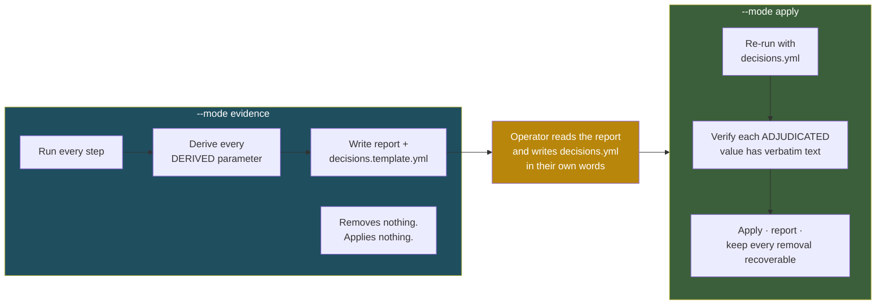
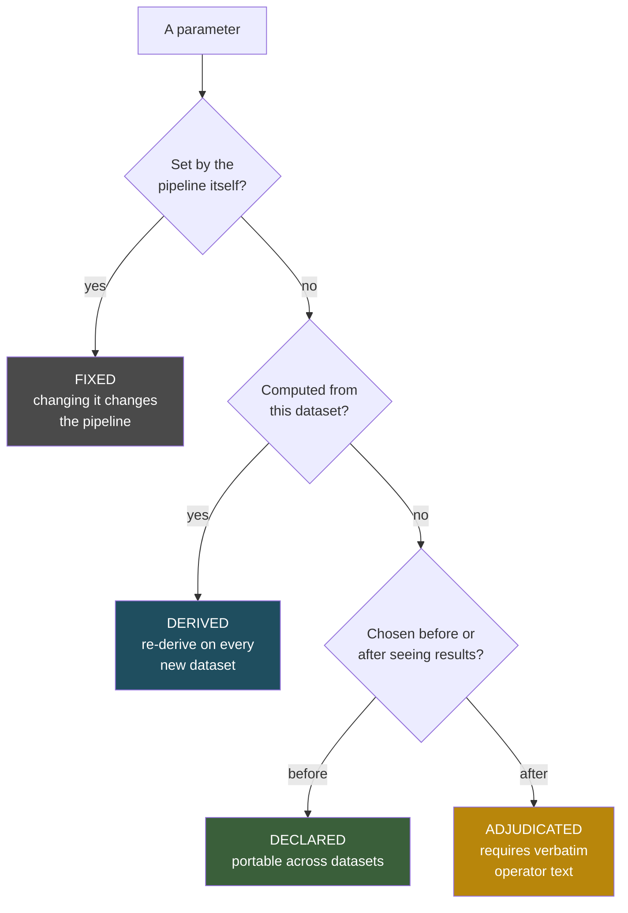

# Workflow

These diagrams are drawn from the modules as they are written, branch by branch, so that a reader
can hold the code and the picture side by side. Where a diagram describes behaviour that is
specified but not yet implemented, it says so on the page.

## The pipeline

```mermaid
flowchart TD
    FQ["FASTQ"] --> P0
    MX["Count matrix<br/>(supplied)"] --> P0

    subgraph S0["Step 0 — Ingest"]
        P0["Validate samplesheet<br/>Resolve reference<br/>Plan per sample"]
        V0{"Is the supplied matrix raw?<br/>P1 values · P2 droplets"}
    end
    P0 --> V0
    V0 -- "raw" --> A0["ACCEPT the matrix"]
    V0 -- "not raw · FASTQ given" --> RB["REBUILD from FASTQ<br/>the matrix is rejected,<br/>the sample is not"]
    V0 -- "not raw · no FASTQ" --> X0["BLOCKED<br/>a pre-filtered matrix<br/>cannot be un-filtered"]
    A0 --> S1
    RB --> S1

    subgraph S1["Step 1 — Ambient RNA"]
        G1{"Assay declared, and<br/>consistent with the<br/>intronic fraction?"}
        A1["Denoise at the package<br/>default rate · or accept<br/>a supplied denoised object"]
        A3{"Is any sample unlike<br/>its siblings? (MAD over<br/>the run diagnostics)"}
        A2["Audit: 5 checks"]
    end
    G1 -- "no" --> XG1["REFUSE · raises<br/>the assay is DECLARED and<br/>a wrong guess is silent"]
    G1 -- "yes" --> A1
    A1 --> A3
    A3 -- "outlier(s)" --> XLR["REFUSE · names them<br/>DETECTION AND REPORTING ONLY:<br/>nothing is re-run automatically"]
    A3 -- "no curve declared" --> RLR["REVIEW · NOT MEASURED<br/>a missing sibling changes what<br/>the rest were compared against"] --> A2
    A3 -- "fewer than 4 comparable" --> RLR
    A3 -- "none" --> A2
    A2 --> V1{"Is removal even<br/>across the design?"}
    V1 -- "≥3× AND worst arm ≥1%" --> X1["REFUSE<br/>a technical property has become<br/>an apparent biological difference"]
    V1 -- "≥3× but under 1%" --> R1["REVIEW<br/>a ratio between two near-zero<br/>rates is reported, not refused"]
    V1 -- "one arm removes nothing" --> R1
    V1 -- "even" --> S2
    R1 --> S2

    subgraph S2["Step 2 — Cell call"]
        C1["Aligner calls vs denoiser calls"]
    end
    C1 --> V2A{"Does the denoiser call<br/>FEWER cells than the aligner?"}
    V2A -- "yes" --> X2A["REFUSE<br/>the boundary has become a filter"]
    V2A -- "no" --> V2{"Aligner cells lost<br/>to the denoiser"}
    V2 -- ">10% — no materiality bound" --> X2["REFUSE"]
    V2 -- "5–10%" --> R2["REVIEW"] --> V2D
    V2 -- "<5%" --> V2D{"Is the loss even<br/>across the design?"}
    V2D -- "≥3× AND worst arm ≥1%" --> X2D["REFUSE"]
    V2D -- "≥3× but under 1%" --> R2D["REVIEW<br/>a ratio between two near-zero<br/>rates is reported, not refused"]
    V2D -- "all loss on one level" --> R2D
    V2D -- "even" --> S3
    R2D --> S3

    subgraph S3["Step 3 — Light floor"]
        F1["Floor for doublet scoring<br/>Count what is never examined"]
        F2{"Strictly below the<br/>quality floor?"}
    end
    F1 --> F2
    F2 -- "no" --> X3["REFUSE · raises<br/>it has stopped selecting a scoring set<br/>and become a quality filter applied<br/>BEFORE doublet detection"]
    F2 -- "yes" --> S4

    subgraph S4["Step 4 — Doublets"]
        D1["Score (scDblFinder, or your detector)"]
        D2["Health checks on the CALLS<br/>step 4 removes nothing"]
    end
    D1 --> D2 --> V4{"Is the call rate silent,<br/>imposed, or uneven<br/>across the design?"}
    V4 -- "a library calls <0.5%" --> X4["REFUSE<br/>a collapsed threshold returns silence,<br/>which is not the same as<br/>finding no doublets"]
    V4 -- "≥3× AND worst arm ≥1%" --> X4
    V4 -- "≥3× but under 1%<br/>· spread too flat or too wide<br/>· nuclei never scored" --> R4["REVIEW"] --> S5
    V4 -- "ok" --> S5

    subgraph S5["Step 5 — Quality thresholds"]
        Q1["Derive UMI / gene floors<br/>from the density valley"]
        Q2{"Bimodal · inside the bounds ·<br/>above the light floor?"}
    end
    Q1 --> Q2
    Q2 -- "no" --> Q3["REFUSE · raises<br/>without two modes the minimum is the<br/>flank of the only one. Choose the cut<br/>explicitly and record it as ADJUDICATED"]
    Q2 -- "yes" --> S6

    subgraph S6["Step 6 — Cluster check"]
        L1["Cluster · profile · flag<br/>A low depth · B high mito<br/>C uninformative markers · D doublet"]
    end
    L1 --> S7

    subgraph S7["Step 7 — Apply"]
        Y1["Pre-flight: contradictions<br/>step 6 already found"]
        Y2{"Recorded approval,<br/>verbatim, for THIS action?"}
    end
    Y1 --> Y2
    Y2 -- "no" --> X7["REFUSE · raises<br/>no force flag exists"]
    Y2 -- "yes" --> OUT["The removal is applied —<br/>the only step that removes —<br/>and every removed observation is<br/>written out with the criteria<br/>that fired on it"]

    style X0 fill:#8B2635,color:#fff
    style XG1 fill:#8B2635,color:#fff
    style X1 fill:#8B2635,color:#fff
    style X2 fill:#8B2635,color:#fff
    style X2A fill:#8B2635,color:#fff
    style X2D fill:#8B2635,color:#fff
    style X3 fill:#8B2635,color:#fff
    style X4 fill:#8B2635,color:#fff
    style Q3 fill:#8B2635,color:#fff
    style X7 fill:#8B2635,color:#fff
    style R1 fill:#B8860B,color:#fff
    style R2 fill:#B8860B,color:#fff
    style R2D fill:#B8860B,color:#fff
    style R4 fill:#B8860B,color:#fff
    style ES fill:#B8860B,color:#fff
    style OUT fill:#1F4E5F,color:#fff
```



Red is a refusal — the run stops and says why. Amber needs a human. The pipeline is designed so
that **the default outcome of an ambiguous situation is a stop, not a guess.**

### How a refusal is delivered

The two forms are not interchangeable, and the diagram marks the difference.

- **· raises** — the module raises its own exception (`AmbientRefusal`, `FloorRefusal`,
  `DoubletRefusal`, `ThresholdRefusal`, `ClusterRefusal`, `ApplyRefusal`). The call does not return
  a usable value, so the refusal cannot be ignored by a caller that reads only the value.
- **everything else** — the module builds findings and `verdict()` reduces them to `REFUSE`,
  `REVIEW` or `PASS`. Returning `"REFUSE"` reports; the **caller** is what stops the run.

### Branches worth reading twice

- **Step 0 rejects a matrix, not a sample.** A supplied matrix that fails P1 or P2 does not stop the
  run when FASTQ is available: the plan becomes *rebuild from FASTQ*, and the matrix is simply not
  used. Only a failing matrix with nothing to rebuild from is blocked. A samplesheet missing a
  DECLARED field — sample, platform, species, reference — is blocked before any of this.
- **The learning-rate check is cohort-relative, and it is not a convergence test.** It asks whether
  any sample's run diagnostics are unlike its siblings', by a robust (MAD) outlier rule. It
  deliberately asserts no direction of *better* for those diagnostics, and it declines to run at all
  below about four samples, where "unlike its siblings" has no meaning.
- **Every differential is bounded twice.** At steps 1, 2 and 4 a ≥3× differential refuses only
  where the loss is also **material** — the worst arm at ≥1%; under that floor it is reported as
  REVIEW, because a ratio between two near-zero rates is dominated by a single library. A ratio
  against an arm at exactly zero is **undefined rather than large**, and is reported as REVIEW with
  the arms printed rather than manufactured into a refusal.
- **The >10% cell-call refusal is the one unconditional rule.** Unlike the differentials it carries
  no materiality bound at all: a library that loses more than a tenth of the aligner's calls to the
  denoiser stops the run whatever the absolute numbers, and a two-cell library losing one cell
  refuses exactly as a large one does.
- **"No valley" is a hard stop, not an amber one.** Step 5 raises rather than handing back a number
  for an operator to sanity-check. A density minimum exists in any smooth curve; without two modes
  it is the flank of the only one, and returning it would dress an arbitrary cut as a measurement.
- **The mitochondrial ceiling takes the other route, and "no valley" does not make it
  underivable.** Its distribution *is* unimodal, so the valley method genuinely does not apply —
  but that rules out one derivation, not all of them. Step 5 derives each library's own upper
  Tukey fence, `Q3 + 1.5 × IQR`, which needs no valley and has no free parameter to tune. The
  **bound** on that fence is DECLARED, in the analyst's own words, because it is a statement about
  what a nucleus can be rather than a property of the cohort — and the derivation refuses if that
  bound binds in most libraries, since a declared number overriding most of the data has become
  the threshold while still being reported as derived.
- **Per library here, cohort-constant for the floors — and the difference is not arbitrary.** The
  valley is the *same physical boundary* in every library (debris against nuclei), so one constant
  is a defensible summary of ten estimates of one quantity. Mitochondrial content is not one
  boundary measured ten times; libraries genuinely differ in it, 4× in Q3 on the calibration
  cohort, and averaging that produces a number describing no library. The objection to
  per-library thresholds — that they make the filter a technical property varying across the
  design — is real, so it is **measured** rather than argued: `assess_mito_removal` refuses at a
  3× design differential. On the calibration cohort it came out 1.02–1.10×.
- **What stays ADJUDICATED is narrower than it was.** Not the ceiling, but whether a
  mitochondria-high *population* is damage or a mitochondria-rich cell type. That needs an
  identity; the pipeline emits cluster-level medians and stops.

## The two phases



Looking at the data and cutting it are separated in time and recorded separately. That separation
is the design — not a workflow convenience.

> **What differs from this diagram today.** `scqc run --mode evidence|apply` drives the steps in
> sequence and writes the report, and apply mode writes the filtered object with its removal
> ledger. Two departures: apply mode is the **default**, and a `decisions.yml` is **optional** —
> without one the pipeline applies the thresholds it derived and records them as `DERIVED` rather
> than `ADJUDICATED`. No figure is produced by any step. See the Status table in
> [README.md](../README.md) and the specification in [REPORT_DESIGN.md](REPORT_DESIGN.md).

## Parameter classes

Every parameter the pipeline uses carries one of four classes, and the report prints it.



Only **DECLARED** values are safe to carry to another dataset unchanged. See
[CALIBRATION.md](../CALIBRATION.md) for how much the DERIVED ones actually moved.

## Repository layout

```
scQC/
├── bin/scqc           entry point for a clone that has not been pip-installed
├── scqc_cli.py        the command-line surface: one subcommand per gate
├── conf/env/          environment recipes and pinned locks
├── docs/              design documents
├── lib/               shared code (input verification)
├── modules/NN_name/   one directory per step
├── references/        reference registry (genomes are not tracked)
├── setup/             environment and project setup scripts
└── tests/             unit suites, adversarial suite, acceptance test
```
